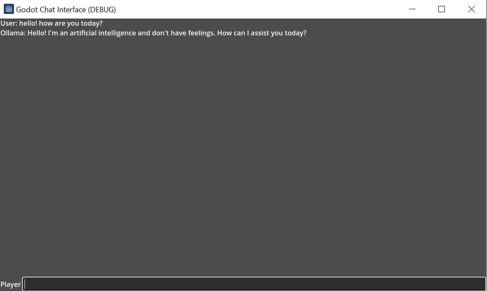

# Godot chat interface

A simple interface for chatting with a language model in Godot Engine. Developed with Godot 4.2.

# Installation and usage

1. Install [Ollama](https://ollama.com/)
2. Download the model you plan to use. Example: `ollama pull qwen2:1.5b`
3. Run the Godot scene

